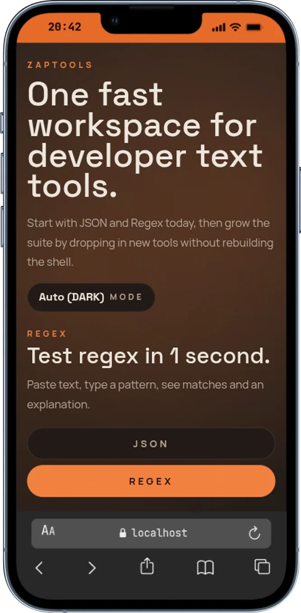

# ZapTools

[](https://github.com/datenflieger/jsonzap/stargazers)
[](https://jsonzap.vercel.app)
[](./LICENSE)
[](https://ko-fi.com/datenflieger)

## Developer utilities in one place

ZapTools combines the fast JSON cleanup flow from JsonZap with the live testing experience from RegexZap in one lightweight app.

## Included tools

- JSON formatter and validator
- Regex tester with live matches
- Pattern explanation helper
- Light, dark, and system theme support

## Screenshots

<table>
  <tr>
    <td align="center"><strong>JSON</strong></td>
    <td align="center"><strong>Regex</strong></td>
  </tr>
  <tr>
    <td align="center"></td>
    <td align="center"></td>
  </tr>
  <tr>
    <td align="center"><strong>Handy</strong></td>
    <td align="center"><strong>Handy</strong></td>
  </tr>
  <tr>
    <td align="center"></td>
    <td align="center"></td>
  </tr>
</table>

## Coming next

1. APIZap - API test tool for cURL to JSON response workflows
2. Base64Zap - Encode/decode utilities with QR support
3. DiffZap - JSON and text diff tool
4. UUIDZap - UUID v4/v5 generation plus hash utilities for backend work

## Quickstart

```bash
npm install
npm run dev
```

## Build

```bash
npm run build
npm run preview
```

## Built with

- React
- Vite
- TypeScript
- Tailwind CSS
- Prism.js

## License

MIT
